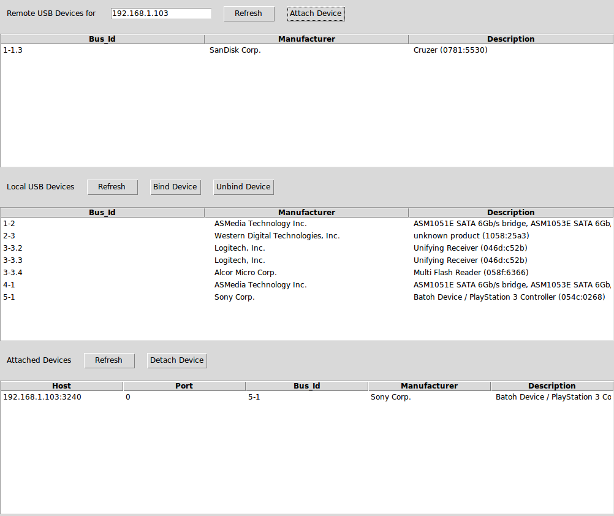

# usbip-gui
An attempt at wrapping the usbip linux kernel module with a gui for easier usability/configurability

# Dependencies
This project only runs on Linux, you will need to install `linux-tools-generic` to get the usbip kernel module. Installation should look something like this: 
```bash
	sudo apt install linux-tools-generic
	sudo modprobe usbip_host
	sudo modprobe usbip_core
	sudo modprobe vhci_hcd
	
	#then to start the gui use either of
	
	sudo python3 gui.py
	
	#or

	python3 main.py

	#which uses gksudo to start the gui 
```

You may also have problems getting `tkinter.ttk` to import correctly. This script assumes that you are using Python 3.8+ so make sure thats the version that you are using.

# Screenshot

